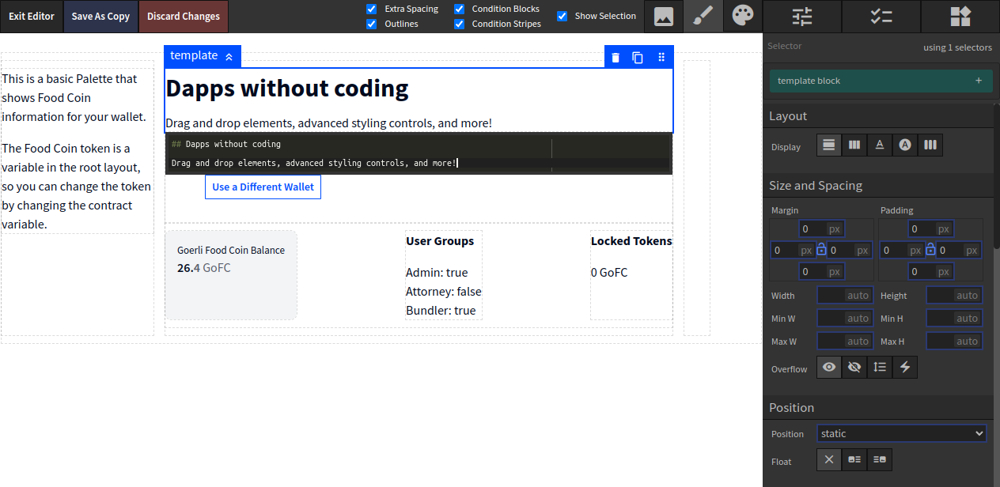

# Blockwell Palette

### Drag-and-drop builder for dapps

-  **Style** Full control over styling
-  **Create** Create your UI by dragging and dropping configurable blocks
-  **bApps** Integrates with Blockwell bApps
    

    

- Want to get started? [Go To Palette](https://app.blockwell.ai/palette2)
- Want to learn more? [Read Documentation](./palette/introduction.md)

# Blockwell Wallet

### Blockwell Wallet is a system for making any kind of blockchain interaction

-  **Wallet** Flexible Wallet for the blockchain
-  **bApps** Use bApps with links or QR Codes to make transactions
-  **Happs** Happs (hybrid apps) combine the power of dapps with the 
    ease of use of centralized apps
    

    

- Want to get started? [Go To Blockwell Wallet](https://app.blockwell.ai)
- Want to learn more? [Read Documentation](wallet/README.md)

# bApps

### bApps make it easy to use the blockchain

-  **Create** Create bApps for your own smart contracts
-  **Any Contract** Works with any smart contract 
-  **Portable** Use links or embeds as needed
    

    

- Want to get started? [Go To Creator](https://app.blockwell.ai/creator)
- Want to learn more? [Read Documentation](./wallet/bapps.md)

# Smart Contracts

### Blockwell has a large library of Smart Contracts for various use cases

-  **Tokens** ERC-20 and ERC-721 compatible tokens
-  **Deployers** Deploy your own contracts in seconds 
-  **Governance** Contracts for governing organizations and funds
    

    

- Want to get started? [Deploy a Token](https://app.blockwell.ai/rks1rq)
- Want to learn more? [Read Documentation](contracts/blockwell-contracts.md)
- Interested in governance? [Shopin Governance](https://app.blockwell.ai/suggestions/shopin)
    *Shopin Token holders are using Suggestions and Voting to decide the project's future*

