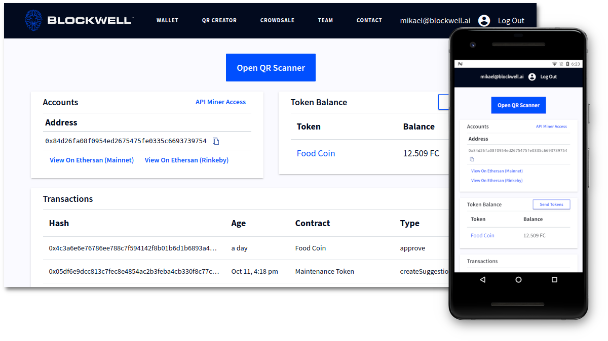

# Blockwell Wallet

### Blockwell Wallet is a system for making any kind of blockchain interaction

-  **Wallet** Flexible Wallet for the blockchain
-  **Dumbapps** Use dumbapps with links or QR Codes to make transactions
-  **Happs** Happs (hybrid apps) combine the power of dapps with the 
    ease of use of centralized apps
    

    

- Want to get started? [Go To Blockwell Wallet](https://qr.blockwell.ai)
- Want to learn more? [Read Documentation](wallet/README.md)

# Smart Contracts

### Blockwell has a large library of Smart Contracts for various use cases

-  **Tokens** ERC-20 and ERC-721 compatible tokens
-  **Deployers** Deploy your own contracts in seconds 
-  **Governance** Contracts for governing organizations and funds
    

    

- Want to get started? [Deploy a Token](https://qr.blockwell.ai/rks1rq)
- Want to learn more? [Read Documentation](contracts/blockwell-contracts.md)
- Interested in governance? [Shopin Governance](https://vote.blockwell.ai/shopin)
    *Shopin Token holders are using Suggestions and Voting to decide the project's future*

