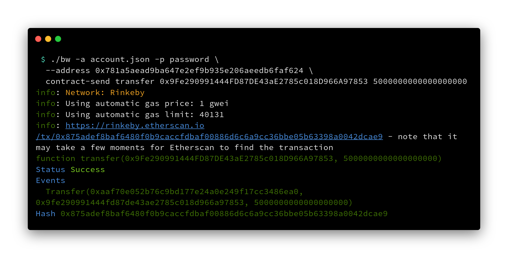

# bw

## Introduction

bw is a command-line tool for Ethereum that can be used to interact with the blockchain,
as well as get data for analysis.

bw supports any Ethereum chain that you can connect to a node for. You can use your own
node, or services like Infura also work.

