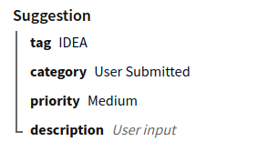

# Data Strings

Ethereum has very limited support for storing and retrieving any kind of structured data.
Smart contracts can only give and take simple values.

Most of the time that's not an issue because you don't want to store a lot of data on the
blockchain anyway, but sometimes it would be useful if data on the blockchain could be
more flexible.

**Data Strings** is our solution to have some structured data without the need to alter
Ethereum itself. Whenever a `string` value is stored on the blockchain, instead of being
just text, it can be [serialized](https://en.wikipedia.org/wiki/Serialization) data.

For example, when using the [Suggestions](./suggestions.md) system, the suggestion can
have data fields in addition to just a description, like this:



That suggestion is being created with four fields called *tag*, *category*, *priority*
and *description*. Each one has its own value, but on the blockchain they're all saved
in the same `string` variable.

## Data Format

How the data is converted to a `string` can vary, but we've chosen to use 
[JSON](https://en.wikipedia.org/wiki/JSON) as the first supported format. 

The example suggestion above would look as follows. Formatted for clarity:

```json
{
    "tag": "IDEA",
    "category": "User Submitted",
    "priority": "Medium",
    "description": "This is a description!"
}
```

[JSON](https://en.wikipedia.org/wiki/JSON) is not the most compact format, but we
chose it for the following reasons:

- It is self-describing - you don't need a separate specification to be able to
  handle it.
- It is human-readable. Even when compressed it is relatively easy to read the data without
  the need for tools.
- It is ubiquitous. Basically any conceivable system can handle it, and browsers support
  it natively.
  
## Using Data Strings

[Blockwell-QR](../qr) fully supports Data Strings, they can be used for any `string`
value with the [Advanced QR Creator](https://qr.blockwell.ai/code/advanced). When
choosing the argument type for a `string`, there is an additional option called
"Multiple". This uses Data Strings.

## Combining Data

When Data Strings are being used for something that's overwriting an existing value
on the blockchain, it can also be configured to combine new data with the existing
data.

For example, suppose there's user configuration stored on the blockchain in a variable
called `userConfig`. The user has previously configured that they don't want
notifications, so `userConfig` looks like this:

```json
{
    "notifications": "disabled"
}
```

If the user wants to add another configuration value, for example their color scheme,
they would set it to this new value:

```json
{
    "colors": "blue"
}
```

If this new `userConfig` is now saved, the notification configuration will be forgotten.

This problem can be avoided using [Blockwell-QR](../qr) by setting the data to be
combined, in which case the new data will be added to the existing values, which will
produce what we want:

```json
{
    "notifications": "disabled",
    "colors": "blue"
}
```
