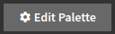
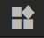

# Integrating bApps to Palettes

A key feature of any dapp is the ability to make transactions on the blockchain, such as transferring tokens or making
a swap. In Blockwell Palettes, this is done through Blockwell's [bApp system](../wallet/bapps.md).

We'll use the `simple` public Palette in this guide.

- [Open Simple Palette](https://app.blockwell.ai/palette2/simple)

## Adding a bApp Block

You can [create a bApp](https://app.blockwell.ai/creator) or [find an existing bApp](https://app.blockwell.ai/bapps) to
use in your Palette, but for this guide we'll use a standard bApp for sending ERC-20 tokens.

Whatever bApp you're using, the main thing you'll need to integrate it into your Palette is its shortcode. This is
6 random numbers and letters that identifies the bApp. For sending ERC-20 tokens, the shortcode is `send20`.

First, click  in the top-left corner
to open the Palette editor, and then click the blocks tab 
in the top-right corner. Drag the bApp block to the palette:

The bApp block is actually a combination of multiple blocks that get added as a group:

The group consists of a **layout** that holds three different components:

- The **bApp** submit button is on the left.
- A **Completed** text and explorer link.
- A **spinner** to indicate the transaction has been submitted.

You'll notice that the completed and spinner components have a gray striped
 background. This indicates that
those pieces would be hidden in the Palette if you weren't in the editor. You can verify that by closing the editor:

The two hidden pieces are inside **conditional** blocks that only show up when the specified condition is met. With
the dumbapp blocks, the **Completed** is only shown when a **transaction has been completed** and the **spinner** is
only shown when the **transaction is still pending**.

::: tip
The bApp is added as a group in order to allow you to make any changes you'd like to it, you can even delete the parts
you don't need.
:::

## bApp Configuration

Configuring the bApp itself is done by selecting the "Submit" button itself, which is the main bApp block, and
opening the Block Settings  tab in the
top-right corner.

::: tip
The internal name for bApps is **dumbapp**, which you will see in a few places.
:::

### Shortcode

The first configuration is the shortcode of the bApp, which we'll set to `send20`. After typing it, the purple
Current Value box will update to reflect the name of the bApp, which in this case is *Transfer Tokens*.

### Arguments

After entering the shortcode, the Arguments for the referenced bApp will be listed. The first argument for the
`send20` bApp is the "chain", which specifies what chain the token is on.

Every argument has a type, which can be one of four values:

- **Form** leaves the value for the user to enter when they're using the bApp.
- **Fill** is the same as *Form*, but lets the user edit the value before submitting.
- **Variable** will load the argument from a Palette variable.
- **Constant** uses a value you set in this argument configuration.

The "chain" and "contract" arguments tell the bApp which ERC-20 token is being sent. We'll use the existing `contract`
variable for both values as follows:

The purple Current Value boxes will update to show that the variables are being loaded correctly.

The "to" and "value" arguments we'll leave for the user to fill, so they can specify where and how many tokens to send:

### Label

The label for the button is just "Submit" by default, but that can be changed:

## bApp Submission Variable

The last configuration in a bApp is the name of the variable to store data in when the user uses the bApp:

The submission variable has all the available details of both the bApp submission and the corresponding transaction
on the blockchain. Use the auto-complete features of the Palette editor to explore all the different values available,
but there is also a list in [the block reference](./blocks.md#submission-variables).

## Next Up

- [Read about all the different types of blocks](./blocks.md) you can add to a Palette.
- [List of variables types and what they all do](./variable-types.md).
- [In-depth details on how variables work](./variables.md) in Palettes.

