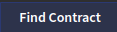

# Blockwell Palette Basics

<Dapp url="https://app.blockwell.ai/suggestions" text="The Palette editor can be used without an account, so feel free to experiment!" type="Palettes"></Dapp>

Right now Palettes are free to be created, copied and used, so jump right in by clicking the button above. You can
follow the guide below for the basics.

## Palette Landing

The landing page lists your saved Palettes as well as a few sample public Palettes to get you started.


For this quickstart, we'll start by creating a new Palette with "Create Palette". This will open a blank Palette. To
start editing the Palette, click  in the top-left corner.

## Palette Editor

The first thing to do with a new Palette is to add some blocks to it. Click the blocks tab 
in the top-right corner. This tab lists all of the possible blocks you can add to a Palette:


## Add Template Block

We'll start by adding a Template  block to
our Palette. Drag the Template block from the right sidebar over to the top of the Palette, and a target will appear:


The green box indicates that's where you're dropping the block you're currently dragging. Go ahead and drop the
Template block, and it will be added to the Palette. Afterwards, it will get selected automatically.

## Block Selection

When a block is selected in the editor, it is surrounded by a blue border:


The template block is empty for now, since we haven't added any contents. Before we write anything, let's take a look
at what controls are found in the blue block selection.

-  tells you the type of the block.
-  lets you quickly select the parent of this block.
-  deletes the block from the Palette.
-  duplicates the block and all its settings.
-  lets you move the block elsewhere in the Palette.

## Editing the Template

Some blocks can be edited by double-clicking the block in the editor. In the case of templates, a text editor will
open below the block that lets you edit its contents. Go ahead and double click the template.


Templates are written using a simple text format called [Markdown](https://www.markdownguide.org/). It uses basic
text characters to represent formatting. Here's a sample:

```markdown
# This is a big heading

Some regular text here!

### The more # characters, the smaller the heading
```

And here's what that looks like in the Palette editor:


## Adding Variables

The real power of Palettes comes from its ability to integrate with the blockchain, and one of the fundamental
pieces to that is **variables**.

**Variables** are how data is added to Palettes. All blocks in a Palette can contain variables, and any blocks
that are inside a block with a variable can use that variable.

With the main layout selected:


Click the Variables tab  in the top-right
corner. This will open up the variables editor in the sidebar:


Click  to create a new blank variable:


There are three elements to all variables:

1. The variable **name** is how the variable can be used in the Palette.
2. The **type** determines how the variable is configured and how it loads data.
3. Every type has its own **configuration** that's below the Variable Type selection.

The default variable type is `literal`, which is just a literal value that doesn't change. Change the variable type
to `contract` (Smart Contract), which loads a smart contract into the variable.

Click the  button to search for
a smart contract. Enter "gofc" to find Goerli Food Coin, and select it. This will fill in the address and chain
for the contract.

Lastly, name the variable `token`, and it should look like this:


You'll notice that there's a "Current Value" preview at the top in the purple box. That will always let you preview
the current value of a variable when applicable. It's showing that the smart contract for the address and chain entered
is called "Goerli Food Coin".

## Using Variables In Templates

Now that we have the `token` variable created, we can use it in the Template we added earlier. In the editor for the
template, which you can open by double-clicking the selected template block, you can use variables by surrounding
the name of the variable with two curly braces `{{` and `}}`. When you type `{{` in the editor, it will pop open
a list of variables to help you, like this:


You can see that there are several variables added as part of the token variable. In addition to its `name`, `address`
and `chain`, there's also a `symbol` if it's a token, and the number of `decimals` it uses.

We'll use the `token` and `token.parameters.symbol` variables and make a few changes to the template:


## Connecting Wallets

An essential part of any dapp is being able to use an Ethereum account on the page, usually through a wallet. Palettes
have a special block for connecting wallets.

Open the  tab again, and drag and drop the Wallet
 block below the template:


When you're dropping a block before or after an existing block rather than inside a layout, a green line will display
where the block will go.

After dropped, the wallet block will be selected, and it will show the standard Blockwell Wallet selection:


The user's wallet will be made available as a variable for the Palette. Let's make use of it next.

## Calling the Blockchain

Select the main layout again:


And then open the Variables tab  in the top-right
corner. You will see the existing `token` variable we already created.
Click  to create a second variable,
name it `balance`, and select the Variable Type `balance` (Token Balance).

For this type of variable, a smart contract and a wallet needs to be configured.

The smart contract can be left on "Auto", since it has picked up the Goerli Food Coin automatically:


For the Wallet, select , and click
the Variable Name text box. If you start typing `w`, it will filter the variables based on that:


Click the `wallet` variable in the list to finish configuring this variable. It should now look like this:


You'll notice that the Current Value will change to reflect the balance of tokens in the configured wallet. Variables
can use other variables in this fashion to construct a page of any complexity.

Lastly, we'll add the balance variable to our template:


## Next Up

- [Read the guide for how to style Palettes](./styling.md).

<!--
- [Read about all the different types of blocks](./blocks.md) you can add to a Palette.
- [List of variables types and what they all do](./variable-types.md).
- [In-depth details on how variables work](./variables.md) in Palettes.
-->
