# Palette Block Types

All Palettes are made up of "blocks", reusable components that can be configured and laid out freely to create pages
and dapps. This page lists all the different types of blocks available.

[[toc]]

## `layout`

The `layout` block is a container for holding other blocks. It can hold any number of blocks inside it, including
additional `layout` blocks to make any kind of arrangement of blocks.

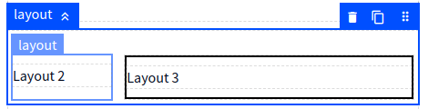

The `layout` block has three variations preconfigured:

- **List** is the default configuration where blocks flow down vertically.
- **Sidebar** is a combination of multiple `layout` blocks set with narrower sidebars on the left and right of a wider
  main area in the middle.
- **Grid** makes blocks inside flow into a responsive grid.

There are no inherent differences between these configurations, they're simply preset options in the Style Editor and
exist for convenience.

#### Configuration

| Name   | Description                                                             | Default value |
|--------|-------------------------------------------------------------------------|---------------|
| layout | The style selector to apply to this layout, which determines its style. | list          |

## `template`

The `template` block is the main way to add text content to a Palette.

- Uses [Markdown](https://www.markdownguide.org/) for text formatting.
- Includes [Mustache](#mustache) templating for using variables. 

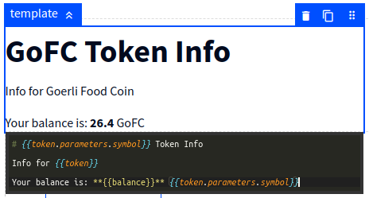

#### Mustache

[Mustache](https://mustache.github.io/mustache.5.html) is a template language that lets you insert variables and
other dynamic elements into text.

With Mustache, you use two curly braces `{{` `}}` to display variables in your text. For example, given the following:

```handlebars
Info for {{token}}
```

The final result would be the text "Info for" followed by the variable `token`.

After you enter two curly braces `{{` in the Palette template editor, a list of available variables will be shown
automatically to make it easy to use.

## `wallet`

The `wallet` block is a special block that connects the user's wallet to the Palette.

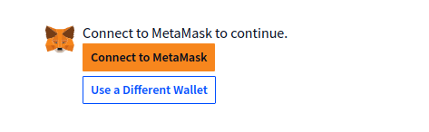

#### Configuration

| Name     | Description                                            | Default value |
|----------|--------------------------------------------------------|---------------|
| variable | The name of the variable to save the user's wallet to. | wallet        |

#### Variables

The `wallet` block adds the following variables to the Palette.

- `wallet` The address of the user's connected wallet.

## `repeat`

When building dapps, sometimes you need to show a list of items where you don't know in advance the whole list. This
could be a list of NFTs owned by the user, or market listings from a smart contract.

The `repeat` block displays all the blocks inside it repeatedly for a list of values. In other words, you can configure
a group of blocks to display a NFT, and then the `repeat` block will duplicate that group for each NFT you want to show.

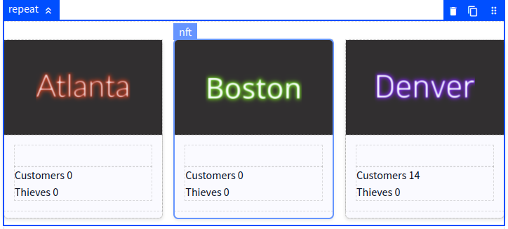

Each repeated group is given a variable called `item` with the corresponding value from the list. For example, let's say
you have a variable with a list of the token IDs `1`, `2` and `3` and you configure a `repeat` block to use this
variable, you would end up with:

- One group of blocks with the `item` variable having a value of `1`.
- A second group of blocks with the `item` variable having a value of `2`.
- A third group of blocks with the `item` variable having a value of `3`.

This is demonstrated in the screenshot above, where Atlanta is the token ID `1`, Boston is the token ID `2`, and
Denver is the token ID `3`. Each group loads the details of its NFT based on the `item` variable separately, so even
though they all have the same configuration, they each show their own NFT.

#### Configuration

| Name   | Description                                                                 | Default value |
|--------|-----------------------------------------------------------------------------|---------------|
| items  | The list to repeat, which can be a variable or constant.                    | *none*        |
| empty  | Message to show when the items list is empty.                               | Nothing here. |
| filter | An optional filter to remove values from the list before displaying it.     | *none*        |
| layout | The style selector to use for this repeat list, which determines its style. | list          |


#### Variables

The `repeat` block adds the following variables to each group inside the repeated blocks:

- `item` The value of the current item in the list of items.
- `index` The order number of the current item, starting with 1.

## `condition`

The `condition` block is a kind of layout that only shows blocks inside it when a given condition is met.

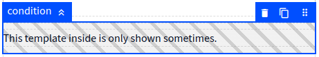

When shown in the Palette editor, diagonal gray stripes are shown behind the block to indicate that it would be
hidden if not for the editor showing it.

There are two special settings in the Palette editor related to `condition` blocks:

- 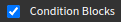 when checked, shows
  condition blocks even if they would normally be hidden.
- 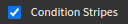 when checked,
  the editor displays the diagonal stripes for hidden blocks.

#### Configuration

| Name         | Description                                                                                                          | Default value |
|--------------|----------------------------------------------------------------------------------------------------------------------|---------------|
| first value  | The value to compare for the condition. If this is the only configured option, the block is shown when this is true. | *none*        |
| operator     | The kind of comparison to perform between the values.                                                                | `==` equals   |
| second value | The second value to compare to the first value using the selected operator.                                          | *none*        |

## `balance`

The `balance` block loads and displays a wallet's token balance for a specific token.

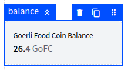

You can also load the balance using variables and then display it with `template` blocks if desired, the `balance`
block is just a shortcut.

#### Configuration

| Name     | Description                                         | Default value             |
|----------|-----------------------------------------------------|---------------------------|
| contract | The token contract to use.                          | Closest contract variable |
| wallet   | The wallet address to load the balance for.         | Closest wallet variable   |
| variable | Name for the variable to save the token balance in. | balance                   |

#### Variables

The `balance` block adds the following variables to the Palette.

- `balance` The token balance shown in the block.

## `nft`

The `nft` block loads the metadata for an NFT, including its name, image and other attributes.

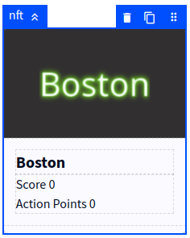

When you add the `nft` block into the Palette, a few additional blocks are added automatically with it since they
are almost always needed:

- `image` block configured to show the NFT's image.
- `layout` block for content below the image.
- `template` block configured to display the name of the NFT.

These additional blocks can be moved or deleted as needed, they are there just for convenience.

#### Configuration

| Name     | Description                                                           | Default value             |
|----------|-----------------------------------------------------------------------|---------------------------|
| contract | The contract for the NFTs.                                            | Closest contract variable |
| token ID | The ID of the NFT to load.                                            | *none*                    |
| variable | Name for the variable to save the NFT's metadata into.                | metadata                  |
| layout   | The style selector to use for this block, which determines its style. | card                      |

#### Variables

The `nft` block adds the following variables to the Palette.

- `metadata` a container for all the data on the NFT.
- `metadata.attributes` holds all the NFT's attributes as defined in the metadata.
- `metadata.collection` the name of the NFT contract, aka. collection.
- `metadata.image` link to the image for the NFT.
- `metadata.name` name of the NFT from its metadata.
- `metadata.tokenId` the token ID for the NFT.

## `image`

The `image` block is used for displaying images in Palettes, and is the only way to show them.

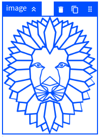

Images can be shown either based on a link, or images can be uploaded to the Palette system.

Typically, a **link** is used when the image is dynamic, such as from the metadata of an NFT.

**Uploading** images can be done using the Palette Image Manager, which you can open by clicking the Image Manager
icon 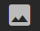 in the top bar of the editor:

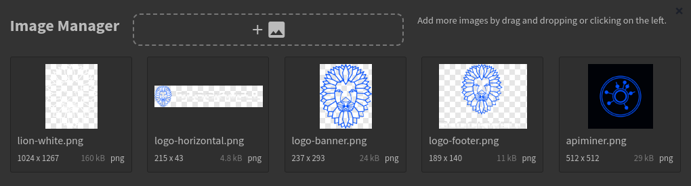

You can also open the Image Manager by **double-clicking the image block**, which lets you quickly change the image
being used.

#### Configuration

| Name   | Description                                                                                      | Default value |
|--------|--------------------------------------------------------------------------------------------------|---------------|
| image  | The link to the image, either a variable or a constant. This can also be an IPFS or Arweave URI. | *none*        |
| layout | The style selector to use for this block, which determines its style.                            | normal        |

## `dumbapp` (bApp)

The `dumbapp` block connects Palettes to [Blockwell bApps](../wallet/bapps.md), a flexible system for submitting
transactions on the blockchain. You can read more about [adding bApps to Palettes in the dedicated guide](./bapps.md).

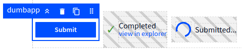

When you add the `dumbapp` block into the Palette, a few additional blocks are added automatically with it:

- `layout` block to hold everything in a row.
- `condition` block with templates to show a completed transaction's result.
- `condition` block to show a progress spinner while waiting for the transaction to complete.

#### Configuration

| Name      | Description                                                                   | Default value |
|-----------|-------------------------------------------------------------------------------|---------------|
| shortcode | The shortcode for the bApp to load, either from a variable or a constant.     | *none*        |
| arguments | A series of configuration values, one for each argument required by the bApp. | *none*        |
| layout    | The style selector to use for this block, which determines its style.         | button        |
| label     | The label text for the button.                                                | Submit        |
| variable  | Name for the variable to save the submission status in.                       | submission    |

#### Submission Variables

The `dumbapp` block adds the following variables to the Palette.

- `submission` holder for the submission data.
- `submission.args` contains all the final arguments passed to the blockchain.
- `submission.created` has the time when the user submitted the transaction.
- `submission.done` shows if the transaction is considered done.
- `submission.events` has a list of all event logs from the blockchain. This is only available after the transaction is
  complete.
- `submission.explorer` contains a link to a block explorer for the transaction once it's available.
- `submission.extras` has extra data added by the Blockwell system, which depends on the smart contract being used.
- `submission.from` has the sender wallet address.
- `submission.id` is the Blockwell system ID of the transaction.
- `submission.pending` shows if the transaction is still pending.
- `submission.shortcode` has the bApp shortcode that was used.
- `submission.status` has the name of the current status of the transaction.

## `spinner`

The `spinner` block is a type of `condition` block that displays a loading spinner when it's shown.

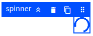

**Note**: the spinner in the Palette editor does not animate because some browsers have difficulty showing a lot of
animated spinners simultaneously, but it will be animated when viewed in the Palette outside the editor.

#### Configuration

| Name         | Description                                                                                                          | Default value |
|--------------|----------------------------------------------------------------------------------------------------------------------|---------------|
| first value  | The value to compare for the condition. If this is the only configured option, the block is shown when this is true. | *none*        |
| operator     | The kind of comparison to perform between the values.                                                                | `==` equals   |
| second value | The second value to compare to the first value using the selected operator.                                          | *none*        |

## `contract`

The `contract` block displays information about a smart contract.

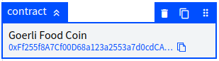

The main advantage of using a `contract` block instead of just text templates is that it provides an automatic link
to a block explorer, and a button to copy the contract's address.

#### Configuration

| Name     | Description                                 | Default value             |
|----------|---------------------------------------------|---------------------------|
| contract | The smart contract to display in the block. | Closest contract variable |


## Next Up

- [List of variables types and what they all do](./variable-types.md).
- [In-depth details on how variables work](./variables.md) in Palettes.
