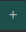

# Blockwell Palette Styling

With Palette's advanced styling controls, you have full control over the look of your Palettes. There are two
sides to styling a Palette:

1. **Color Theme** lets you quickly change all colors used in the Palette for fast and easy branding.
2. The **Style Editor** gives you full control over all aspects of styling.

For this guide, we'll be looking at the `simple` public Palette and giving it a makeover.

- [Open Simple Palette](https://app.blockwell.ai/palette2/simple)

Here's what that Palette looks like without any styling:

## Color Theme

The first thing to modify is the Color Theme for the Palette. This lets you quickly change all the colors used in
the Palette.

First, click  in the top-left corner to
open the editor, and then go to the Color Theme 
tab in the top-right corner. This will open the Color Theme editor:

When you click any of the colors, a color picker is opened where you can change that color:

You may have noticed that each color in the list has three variations:

- The largest center part is the main color exactly as shown.
- The left edge is a darker version of the color, calculated automatically.
- The right edge is a lighter version of the color, also automatic.

These variations give you a bit more flexibility in the Color Theme without having to individually define them.

## Dark Theme

Let's change the colors to turn the Palette into a dark-themed page:

- **Primary**: `#65C2CB`
- **Background**: `#04192A`
- **Text**: `#FFFFFF`
- **Highlight**: `#FFFFFF`
- **Link**: `#34797D`

The Color Theme editor should now look like this:

And the Palette itself will look like this:

## Font Change

The colors are all now based on our new dark branding, but we also want to use a new font. For this, we'll turn to the
Style editor, which you can open by clicking the Style 
tab in the top-right.

Select any block in the Palette, and it'll show the styling controls for that Block. For example, after selecting one
of the template blocks:

There are many style controls available, but right now we'll focus on the top of the Style Editor. Palette styles
are based on **Selectors**, and **any change made to a style is applied to all** parts of the Palette that have the
**same selector**. For example, the `template block` selector is shared by all template blocks, so any changes you make
to it will be applied to all template blocks.

For **changing the font**, we're going to modify the global selector called "Palette". Click the current selector
(eg. template block), which will open up a list of all selectors affecting the current block:

Click the purple Palette selector, which will bring up a more limited set of styling options that applies to the
whole Palette. This includes the font, which we'll change to "Exo" for a more futuristic look:

## Heading Font

Next, let's say we want to change the font for just headings. Instead of changing the Palette style or all template
blocks, we can create a new custom selector.

Select the large "Goerli Food Coin" template in the Palette first, and then click the plus
 button on the right of the current selector.
This will open a text box where you can either find an existing custom selector, or type in a new one. We'll create
a new one called heading:

Press enter or click Add Selector, which will create the heading selector and apply it to the current block:

You'll notice that the gold custom selectors have a trash 
icon that lets you delete the selector from the current block.

With this new heading selector in use, scroll down to Typography and change the Font to "Playball". This will change the
"Goerli Food Coin" text to this new font, but all the other templates are still using Exo:

## Heading Color

Lastly, let's look at how Color Themes can be used in the Style Editor. To demonstrate that, we'll change the color
of the heading template text. With the "Goerli Food Coin" block selected, scroll down to Typeface and click the
Color field to open the color picker:

You'll notice that compared to when we were editing the Color Theme, the color picker has an addition: all the colors
from our Theme are available as swatches at the bottom.

Using these swatches will make sure the colors are always coming from the Color Theme. After you click on one of them,
the actual color in the Color field will have a reference to the name of the color rather than the color code, like so:

::: detail
The format of the color `var(--primary)` may seem strange, but it's actually using the CSS standard way to refer
to variables. Under the hood all the styling is converted to CSS, so it's simply showing the CSS value.

The `var()` part of the value means it's a "variable" reference, and the actual variable being used is `--primary`. The
two dashes are a requirement for CSS, as they are technically known as custom properties. You can
[read more about them on MDN](https://developer.mozilla.org/en-US/docs/Web/CSS/Using_CSS_custom_properties).
:::
