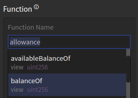
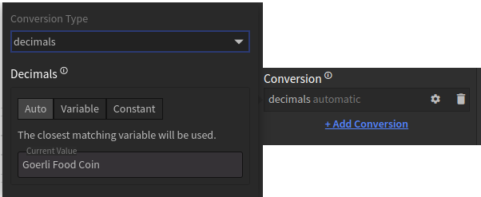
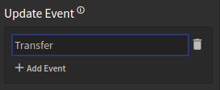
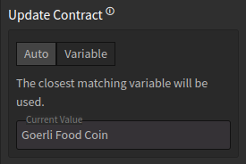
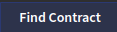
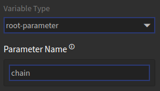

# Palette Variable Types

Each variable in a Palette has a type, and that type determines how the variable loads its data and how that's 
configured. This page lists all the available variable types.

[[toc]]

## `balance`

**Token Balance**: Load a token balance for a wallet.

Essentially a simplified version of a `call` variable that fills in many of the configuration parameters for
a balance call.

#### Configuration

| Name     | Description                             | Default value             |
|----------|-----------------------------------------|---------------------------|
| contract | Token contract to read balance from.    | Closest contract variable |
| wallet   | Wallet or contract to read balance for. | Closest wallet variable   |


## `call`

**Read Smart Contract**: Read data from a smart contract on the blockchain.

This can call any smart contract function on a supported blockchain and retrieve the result, and is the foundation
for building dapps that utilize data from the blockchain.

### Call Contract

The smart contract to be called should first be stored in a Palette variable, and the `call` variable can then
be configured to use that contract. In most cases all the necessary data for the smart contract is pulled from
Blockwell's [API Miner](../tools/apiminer/README.md).

### Function

All calls to smart contracts require an [ABI (Application Binary Interface)](https://en.wikipedia.org/wiki/Application_binary_interface),
which is a description of how the call and its response should be formatted. Once the contract has been configured,
the editor will help you choose from all available functions in the contract.



The list of functions shows the name for each as well as the type of data returned (eg. `uint256`).

### Call Arguments

After a contract and a function has been selected, the editor will detect the necessary arguments for the function,
and show the configuration for each one.

To call a smart contract function, all arguments need to be filled in with a value. Each value can either come from
a variable, or be set to a constant.

### Conversion (optional)

In some cases, the response from the blockchain isn't directly usable, and needs to be converted first. The most common
scenario is with token amounts, all token amounts are always given in the smallest possible unit. For example,
1 Ether on the blockchain is actually `1 000 000 000 000 000 000` - that's 1 followed by 18 zeroes. The convention is
to always convert the right-most 18 digits into decimals before displaying the value.



The available conversions are as follows:

- **decimals**: convert decimals for token and coin amounts.
- **date**: convert a numeric date into a human-readable date. Blockchain dates are usually in 
  [Unix time](https://en.wikipedia.org/wiki/Unix_time), and look something like this: `1675203143`.
- **time-difference**: converts a number of seconds into a human-readable time difference. For example, `300` seconds
  would be converted into `5 minutes`.

### Update Events (optional)

When you call the blockchain for a value, such as a token balance, that value won't stay the same forever. A token
balance will change as soon as tokens are transferred, as will a NFT's ownership. Calling the blockchain over
and over again constantly to see if the value has changed is highly inefficient.

To get around this issue, Palette `call` variables can be configured to update based on events on the blockchain. Smart
contracts have event logs that get created whenever something notable happens. For example, when tokens are transferred,
a `Transfer` event is created. The Palette can listen to those events to update only when needed.



In order for Palette to know which events to listen to, the `call` variable needs to be configured. When you add an
event to the Update Event configuration, the editor will show you a list of all the available events, so you can pick
the right one.



In most cases the `Auto` contract option is correct, but the editor does allow for listening to a different contract
if needed.

#### Configuration

| Name            | Description                                                            | Default value             |
|-----------------|------------------------------------------------------------------------|---------------------------|
| contract        | Contract to use.                                                       | Closest contract variable |
| Function        | Smart contract function to read from.                                  | *none*                    |
| Arguments       | Arguments for the function.                                            | *none*                    |
| Conversion      | Decimal and formatting conversion for the value.                       | *none*                    |
| Update Contract | Smart contract for update events, if different from the call contract. | Closest contract variable |
| Update Event    | Events in the smart contract that should trigger this call to update.  | *none*                    |
| Cache Seconds   | Custom time to cache results for in seconds.                           | *none*                    |

## `condition`

**Condition**: Compares values and turns that into a true/false variable.

The [`condition` block](./blocks.md#condition) uses this type of variable for its logic, and they are configured the same way.

#### Configuration

| Name         | Description                                                                 | Default value |
|--------------|-----------------------------------------------------------------------------|---------------|
| first value  | The value to compare for the condition.                                     | *none*        |
| operator     | The kind of comparison to perform between the values.                       | `==` equals   |
| second value | The second value to compare to the first value using the selected operator. | *none*        |

## `contract`

**Smart Contract**: Load a smart contract into a variable.

This variable type uses an address to load the full data for a smart contract, including everything needed for it
to be utilized in calls and transactions.

The additional data is loaded through [API Miner](../tools/apiminer/README.md), which can detect a variety of different
types of smart contracts. You can also use the 
button to search for a contract by name.

#### Configuration

| Name          | Description                          | Default value |
|---------------|--------------------------------------|---------------|
| address       | Address for the smart contract.      | *none*        |
| Chain/Network | Chain or network the contract is on. | *none*        |


## `dumbapp`

**Dumbapp (bApp)**: Load a dumbapp into a variable.

This variable type is used by the [`dumbapp` block](./blocks.md#dumbapp-bapp) to load bApps. In most cases there is
no need to use this variable directly.

#### Configuration

| Name      | Description                        | Default value |
|-----------|------------------------------------|---------------|
| shortcode | Shortcode for the dumbapp to load. | *none*        |

## `image`

**Image**: Load an image into a variable.

This variable type is used by the [`image` block](./blocks.md#image) to load up images from URLs. In most cases there is
no need to use this variable directly.

#### Configuration

| Name      | Description                    | Default value |
|-----------|--------------------------------|---------------|
| Image URI | The link or URI for the image. | *none*        |


## `literal`

**Literal Value**: Enter a value that doesn't change.

This type can be used to add a variable with a known, static value into the Palette. This is useful in cases where
you need to use a known value in multiple places, and makes it easier to change later.

#### Configuration

| Name  | Description               | Default value |
|-------|---------------------------|---------------|
| value | The literal value to use. | *none*        |

## `nft`

**NFT Item**: Load an NFT item and its metadata.

This variable type, which is also used by the [`nft` block](./blocks.md#nft), loads the metadata for a NFT, along with
a few additional fields:

- `attributes` holds all the NFT's attributes as defined in the metadata.
- `collection` the name of the NFT contract, aka. collection.
- `image` link to the image for the NFT.
- `name` name of the NFT from its metadata.
- `tokenId` the token ID for the NFT.

#### Configuration

| Name         | Description                        | Default value             |
|--------------|------------------------------------|---------------------------|
| NFT Contract | Contract to load an NFT item from. | Closest contract variable |
| Token ID     | Token ID of the NFT item to load.  | *none*                    |

## `owned-nfts`

**Owned NFTs**: Load a list of NFTs owned by a wallet.

Based on an NFT contract and a wallet address, this variable gets a list of all NFTs from that contract that
the wallet is holding.

#### Configuration

| Name         | Description                        | Default value             |
|--------------|------------------------------------|---------------------------|
| NFT Contract | Contract to load an NFT item from. | Closest contract variable |
| wallet       | Wallet to load NFTs for.           | Closest wallet variable   |

## `root-parameter`

**Palette Parameter**: Use a parameter to the palette as a variable, such as a URL parameter.

This is a special variable that allows the Palette to use values given to the Palette externally. When the Palette is
used as a page on its own, this would be from the URL. For example, if we have a parameter named "chain" like this:



The value of that variable would come from the `chain` query parameter in the link, which might look something like
this:

```
https://app.blockwell.ai/palettes/simple?chain=mainnet
```

Note the `?chain=` at the end, followed by the value `mainnet`.

In the case of embedded Palettes, the value is provided by the embed code.

#### Configuration

| Name           | Description                                      | Default value |
|----------------|--------------------------------------------------|---------------|
| Parameter Name | Name of the parameter to load into the variable. | *none*        |

## `template`

**Template**: Turn a template into a variable.

While this variable type is generally used in [`template` blocks](./blocks.md#template), you can also store the
template result in a variable to make it reusable across the Palette.

You can read more about [editing templates in our Palette Basics guide](./basics.md#editing-the-template).

#### Configuration

| Name     | Description                               | Default value |
|----------|-------------------------------------------|---------------|
| Template | The code for the template to be rendered. | *none*        |


## Next Up

- [In-depth details on how variables work](./variables.md) in Palettes.
