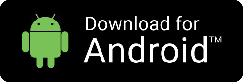

# Blockwell-QR

[https://qr.blockwell.ai](https://qr.blockwell.ai)

## Introduction

Blockwell-QR is a system for making any kind of blockchain interaction very easy.
Anyone can create special QR Codes that when scanned using the Blockwell-QR Wallet
app let anyone make transactions with smart contracts in a few seconds.

The QR Codes can be simple things like transferring tokens, or they can be complex
multi-step actions that do several transactions in one.

The QR Codes can be used on any system that has a web browser. On mobile devices
you can just scan the QR and it'll load up the right transaction.

## Blockwell-QR Apps

Blockwell-QR is currently available as a native app for Android, and as a web app
for other systems.

Or you can [use the Web App here](https://qr.blockwell.ai/app).
