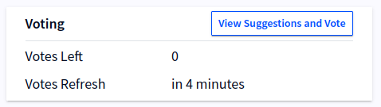

# Suggestions and Voting

Suggestions are short pieces of text that token holders can create, 
as well as vote on. All data on suggestions are stored on the blockchain 
in a transparent manner.

A suggestion can be a communication or some action you’d like to bring 
attention to, and have users vote on which ones the community cares the most about.

This page will tell you how to view suggestions and cast votes. To find more about
the technical details behind them, [read more here](../contracts/suggestions.md).

### Creating Suggestions And Casting Votes

Both creating suggestions and voting on them is straight-forward, and can be done 
using either the web app or the Android app.

## Web App

Open the Wallet app in your browser:  
[https://qr.blockwell.ai/app](https://qr.blockwell.ai/app)

After logging in, the top of the page will show a Voting box that tells you 
how many  votes you still have left currently, and when your vote allocation 
will be refreshed.

::: tip
If you don't see a Voting box on the page, then your account isn't set up for it.
You can still view suggestions for a contract using the 
[Web Suggestions Viewer](https://qr.blockwell.ai/suggestions).
:::

Clicking the “View Suggestions and Vote” button will take you to the 
Suggestions Viewer page that lets you view all current suggestions and 
proposals, as well as vote for them and share them.

The “vote” link opens a form to cast a vote on that suggestion or proposal.

The “share” link opens a page with a QR Code you can share for others to 
scan using their mobile devices, and a web link you can send that opens 
the form to cast votes.

There is also a button at the top to “+ Create Suggestion”, which allows 
you to create a new suggestion.

## Android

After [installing the Android app](./getting-started-android.md) and 
logging in with your account, you can open the Suggestions Viewer using 
the top-right menu  
 and pressing “Suggestions Viewer”.

This screen lists all the suggestions and proposals users have created, 
as well as the amount of votes they have received. Pressing on a suggestion 
or proposal will let you vote for each one if you still have votes left. 
You can see how many votes you have left at the top of the screen, as well 
as how soon your votes will be refreshed.

The floating action button  
lets you create a new suggestion that can then 
be voted on.

## Notifications

You will automatically receive an email notification when a suggestion
you created or voted on is promoted into a proposal. You will also receive 
an email when someone leaves a comment on a suggestion or proposal you 
created or voted on.

If you want to stop receiving the notifications, each notification email has
a link at the bottom to stop further notifications.
