# API Miner Quickstart

There are two options for quickstart:

1. Using the `curl` command line tool, which is commonly already installed on
many systems.
2. Using the Postman HTTP client.

## Using cURL

### cURL Prerequisites

`curl` is used in a terminal, so some familiarity with running a command line
terminal is needed. All commands in this curl section are intended to be
typed into a terminal.

You'll need `curl` itself installed. You can test to see if it's already
installed by running:

```
curl --version
```

If it's not installed, install it using the appropriate installation method
for your system:

- **Linux**
    - **Debian** and derivatives: `sudo apt-get install curl`
    - **Arch** and derivatives: `pacman -S curl`
    - **Fedora**: `yum install curl`
- **Mac OS X**
    - If you don't have it, first install [Homebrew](https://brew.sh/)
    - Then run `brew install curl`
- **Windows**
    - **NOTE!** The curl commands in this quickstart won't work in Windows' cmd or PowerShell terminals without modification. We recommend using Postman, or some other REST client.
    - Download the curl binary [here](https://curl.haxx.se/dlwiz/?type=bin&os=Win32&flav=-)
    and add it to your PATH.

#### Using `jq` (optional)

If your system has `jq` installed (or you can always install it 
[from here](https://stedolan.github.io/jq/download/)), you can use it to make the JSON
output easier to read. Simply add ` | jq` at the end of every command.

### 1. List accounts

You should've already received the address of your first Ethereum account on
API Miner, but as the first step we'll go ahead and list all of our accounts.

```bash
curl -X GET \
    https://apiminer.blockwell.ai/accounts \
    -H 'Authorization: Bearer apiminertestauth'
```

As mentioned earlier, copy and paste the curl command to your terminal. Make
sure you get the whole command, as it's split on multiple lines for easier
reading.

The response will look like this, except it will be unformatted if not using [jq](#using-jq-optional):

```json
{
  "data": [
    {
      "id": "decd1dd0-4b24-4f1b-86fd-e0479d8ca3a6",
      "address": "0xd684ea9d172552e28ca8dfe4d9d39b49180741e7",
      "owner": "67fe8cbc-b165-4100-aa0c-03b029fabe77",
      "defaultAccount": true
    }
  ]
}
```

The `id` is the globally unique identifier of this account, and the `address`
is the Ethereum address of the account. You'll need the `address` for some of
the quickstart steps.

### 2. Getting Pump tokens

Next, call the `mint` function on the Pump token smart contract to get
yourself some tokens.

Use the following:

```bash
curl -X POST \
    https://apiminer.blockwell.ai/contracts/54ccdb8a-8177-4bbf-8a3a-1af38be82a33/send/mint \
    -H 'Authorization: Bearer apiminertestauth' \
    -H 'Content-Type: application/json' \
    -d '{
        "arg": [
        "0xd684ea9d172552e28ca8dfe4d9d39b49180741e7",
        "100000000000000000000"
        ]
    }'
```

The response will look like this:

```json
{
  "data": {
    "id": "0d3a809f-f832-4de1-9839-7b8b767ee9b6",
    "type": "contract-method",
    "contractId": "54ccdb8a-8177-4bbf-8a3a-1af38be82a33",
    "from": "0xd684ea9d172552e28ca8dfe4d9d39b49180741e7",
    "method": "mint",
    "parameters": [
      "0xd684ea9d172552e28ca8dfe4d9d39b49180741e7",
      "100000000000000000000"
    ],
    "status": "new",
    "created": "2020-08-27T23:48:58.634Z",
    "network": "rinkeby"
  }
}
```

Since transactions on the blockchain take some time, the API doesn't wait for
it to finish, it just gives you the info you submitted and an ID you can use
to refer to it later.

### 3. Getting the status of a transaction

To see what happened to the transaction from the previous step, use the following
with:

- `<id>` replaced with the transaction ID you received in the previous step.

```bash
curl -X GET \
    https://apiminer.blockwell.ai/transactions/<id> \
    -H 'Authorization: Bearer apiminertestauth'
```

The transfer should be completed within 15 seconds, after which you'll see
the following response:

```json
{
  "data": {
    "id": "0d3a809f-f832-4de1-9839-7b8b767ee9b6",
    "type": "contract-method",
    "contractId": "54ccdb8a-8177-4bbf-8a3a-1af38be82a33",
    "from": "0xd684ea9d172552e28ca8dfe4d9d39b49180741e7",
    "method": "mint",
    "parameters": [
      "0xd684ea9d172552e28ca8dfe4d9d39b49180741e7",
      "100000000000000000000"
    ],
    "status": "completed",
    "created": "2020-08-27T23:48:58.634Z",
    "submitted": "2020-08-27T23:49:10.112Z",
    "ended": "2020-08-27T23:49:23.520Z",
    "transactionHash": "0x0826cd738abd10fa815f488107c47e367349698a891eeabeb379ecaeac835662",
    "blockNumber": 7094422,
    "events": ["..."],
    "network": "rinkeby"
  }
}
```

The status showing `completed` means the call was successful.

### 4. Getting your token balance

To double check that you did actually get the Pump tokens, use:

```bash
curl -X GET \
    https://apiminer.blockwell.ai/tokens/54ccdb8a-8177-4bbf-8a3a-1af38be82a33/balances/default \
    -H 'Authorization: Bearer apiminertestauth'
```

This will get the token balance for token ID `54ccdb8a-8177-4bbf-8a3a-1af38be82a33` -
which is the Pump token - for your default account.

The response is as follows:

```json
{"data":"100000000000000000000"}
```

### 5. Creating an Ethereum account

To create a new Ethereum account, use:

```bash
curl -X POST \
    https://apiminer.blockwell.ai/accounts \
    -H 'Authorization: Bearer apiminertestauth'
```

The response is as follows:

```json
{
  "data": {
    "id": "370fb7ab-f589-478f-aa1c-d59f775b1583",
    "address": "0x5aabd741e0adc7915aa540d75fd49c7b4f953bfb",
    "owner": "67fe8cbc-b165-4100-aa0c-03b029fabe77",
    "defaultAccount": false
  }
}
```

Note that this new account is not your default account, so it will only be used
if you specify it in the API calls. We'll look at how to do that below.

### 6. Transferring tokens

To transfer 2 PMP tokens from your default account to the newly created one, use:

- `<address>` replaced with the address of your second account you just created.

```bash
curl -X POST \
    https://apiminer.blockwell.ai/tokens/54ccdb8a-8177-4bbf-8a3a-1af38be82a33/transfers \
    -H 'Authorization: Bearer apiminertestauth' \
    -H 'Content-Type: application/json' \
    -d '{
        "to": "<address>",
        "value": "2000000000000000000"
    }'
```

The response is as follows:

```json
{
  "data": {
    "id": "e052bd11-d899-4444-814b-d179444e6b9d",
    "type": "contract-method",
    "contractId": "54ccdb8a-8177-4bbf-8a3a-1af38be82a33",
    "from": "0xd684ea9d172552e28ca8dfe4d9d39b49180741e7",
    "method": "transfer",
    "parameters": [
      "0x5aabd741e0adc7915aa540d75fd49c7b4f953bfb",
      "2000000000000000000"
    ],
    "status": "new",
    "created": "2020-08-27T23:51:54.964Z",
    "network": "rinkeby"
  }
}
```

As before, the response refers to a transaction, rather than the result of the
transfer. Refer to step 3 to check on the status of the transaction.

### 7. Get the token balance of another account

In step 4 we retrieved the balance of your default account, but you can also
query the balance of any other account by their address.

To check the balance of your second account, use:

- `<address>` replaced with the address of your second account.

```bash
curl -X GET \
    https://apiminer.blockwell.ai/tokens/54ccdb8a-8177-4bbf-8a3a-1af38be82a33/balances/<address> \
    -H 'Authorization: Bearer apiminertestauth'
```

The response is as follows:

```json
{
  "data": "2000000000000000000"
}
```

### 8. Return half of the tokens

To demonstrate sending tokens from a non-default account, we'll send half of the
tokens back. Use:

- `<new-address>` replaced with the address of your new account.

```bash
curl -X POST \
    https://apiminer.blockwell.ai/tokens/54ccdb8a-8177-4bbf-8a3a-1af38be82a33/transfers \
    -H 'Authorization: Bearer apiminertestauth' \
    -H 'Content-Type: application/json' \
    -d '{
        "from": "<new-address>",
        "to": "0xd684ea9d172552e28ca8dfe4d9d39b49180741e7",
        "value": "1000000000000000000"
    }'
```

The response is as follows:

```json
{
  "data": {
    "id": "611d145a-840a-425e-997b-196e57cae83c",
    "type": "contract-method",
    "contractId": "54ccdb8a-8177-4bbf-8a3a-1af38be82a33",
    "from": "0x5aabd741e0adc7915aa540d75fd49c7b4f953bfb",
    "method": "transfer",
    "parameters": [
      "0xd684ea9d172552e28ca8dfe4d9d39b49180741e7",
      "1000000000000000000"
    ],
    "status": "new",
    "created": "2020-08-27T23:56:08.531Z",
    "network": "rinkeby"
  }
}
```

As before, refer to step 3 to get the status of the transaction.

## Using Postman

### Postman Prerequisites

You'll need [Postman](https://www.getpostman.com/) installed, follow their
documentation for installation.

Download the Postman collection for API Miner:

[API Miner collection](https://docs.blockwell.ai/apiminer/api/apiminer-collection.json)

After installing, import the collection:

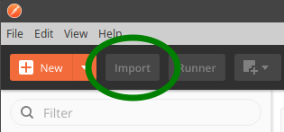

Under Import File click Choose Files and find the `apiminer-collection.json` 
file you downloaded, or drag and drop it to where it says "Drop files here".

Next, create a new Postman environment by clicking the gear icon:

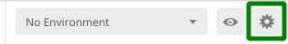

In the top-right corner. Click the Add button, and configure the new environment
as follows:

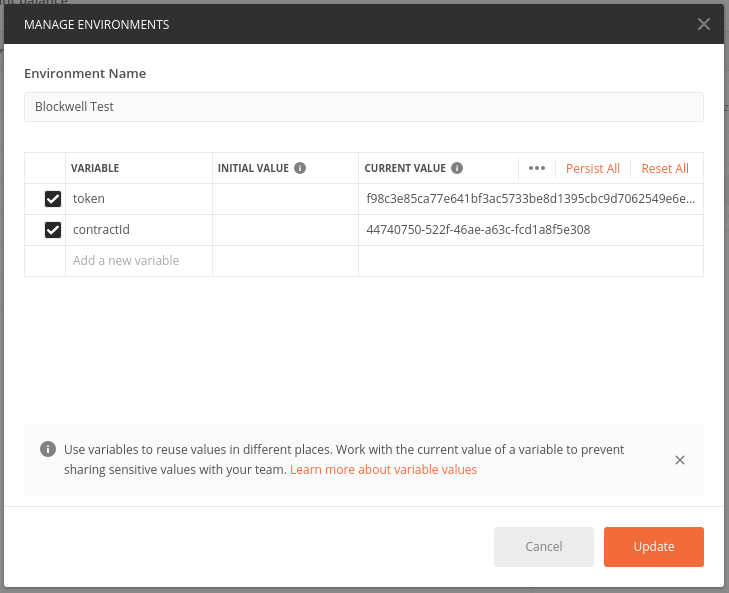

- token: `apiminertestauth`
- contractId: `54ccdb8a-8177-4bbf-8a3a-1af38be82a33`

For the name you can enter anything you want, it's for your own reference.

You can now use the API Miner collection to make calls to the API.

::: tip
If you want to use a different API Miner environment than the default
`apiminer.blockwell.ai`, you can add another variable called `host` with
the hostname of the environment to use.
:::

### 1. List accounts

You should've already received the address of your first Ethereum account on
API Miner, but as the first step we'll go ahead and list all of our accounts.

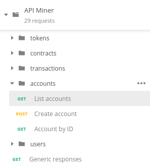

Find the "GET List accounts" endpoint, and click Send 
.

You'll see a response like this:

```json
{
  "data": [
    {
      "id": "decd1dd0-4b24-4f1b-86fd-e0479d8ca3a6",
      "address": "0xd684ea9d172552e28ca8dfe4d9d39b49180741e7",
      "owner": "67fe8cbc-b165-4100-aa0c-03b029fabe77",
      "defaultAccount": true
    }
  ]
}
```

The `id` is the globally unique identifier of this account, and the `address`
is the Ethereum address of the account. You'll need the `address` for some of
the quickstart steps.

::: detail
The `owner` value shows the ID of the user that owns the account, so it will
show your user ID. `defaultAccount` indicates if the account will be the one
used by default when submitting transactions without specifying an account.
:::

### 2. Getting Pump tokens

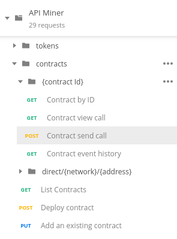

Next, use the "POST Contract send call" endpoint to call the token contract with
the token minting function.

Under *Params* find the `method` Path Variable, and give it the value `mint`.

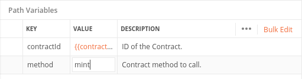

Use the following Body with:

- `<address>` replaced with your account address from the first step.

```json
{
    "arg": [
        "0xd684ea9d172552e28ca8dfe4d9d39b49180741e7",
        "100000000000000000000"
    ]
}
```

Then click Send 
.

The response will look like this:

```json
{
  "data": {
    "id": "0d3a809f-f832-4de1-9839-7b8b767ee9b6",
    "type": "contract-method",
    "contractId": "54ccdb8a-8177-4bbf-8a3a-1af38be82a33",
    "from": "0xd684ea9d172552e28ca8dfe4d9d39b49180741e7",
    "method": "mint",
    "parameters": [
      "0xd684ea9d172552e28ca8dfe4d9d39b49180741e7",
      "100000000000000000000"
    ],
    "status": "new",
    "created": "2020-08-27T23:48:58.634Z",
    "network": "rinkeby"
  }
}
```

Since transactions on the blockchain take some time, the API doesn't wait for
it to finish, it just gives you an ID that you can use to refer to it later.

::: detail
In addition to the `id`, there are several fields as part of the response.
You can read more about each field in the 
[API Spec](https://docs.blockwell.ai/apiminer/api/#operation/ContractSend), just scroll
down to the Responses and click `data` to show the fields.
:::

### 3. Getting the status of a transaction

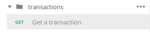

To see what happened to the transaction from the previous step, use the
"POST Get a transaction" endpoint. Under Params, Path Variables, set the value
of `id` to the `id` from the mint response.

The transfer should be completed within 15 seconds, after which you'll see
the following response:

```json
{
  "data": {
    "id": "0d3a809f-f832-4de1-9839-7b8b767ee9b6",
    "type": "contract-method",
    "contractId": "54ccdb8a-8177-4bbf-8a3a-1af38be82a33",
    "from": "0xd684ea9d172552e28ca8dfe4d9d39b49180741e7",
    "method": "mint",
    "parameters": [
      "0xd684ea9d172552e28ca8dfe4d9d39b49180741e7",
      "100000000000000000000"
    ],
    "status": "completed",
    "created": "2020-08-27T23:48:58.634Z",
    "submitted": "2020-08-27T23:49:10.112Z",
    "ended": "2020-08-27T23:49:23.520Z",
    "transactionHash": "0x0826cd738abd10fa815f488107c47e367349698a891eeabeb379ecaeac835662",
    "blockNumber": 7094422,
    "events": ["..."],
    "network": "rinkeby"
  }
}
```

The status showing `completed` means the call was successful.

### 4. Getting your token balance

To double check that you did actually get the Pump tokens, use the "GET Default
account balance" endpoint.

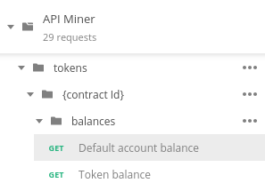

No parameter changes are needed, just hit Send 
.

The response is as follows:

```json
{"data":"100000000000000000000"}
```

::: tip
Ethereum doesn't support decimals, so instead it's just a really big number.
To get the value with decimals, you divide it:

$${100000000000000000000 \over 1000000000000000000} = 100$$

The divisor is `1e18`, or in other words 1 followed by eighteen 0's. The 18
is arbitrary, but it's what ETH and most tokens use. If you're dealing with
a token using a different number of decimals, just use that number instead
of 18. The raw value is often also called "Wei".

That means we just minted 100 tokens to ourselves.
:::

### 5. Creating an Ethereum account

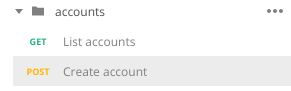

To create a second Ethereum account, use the "POST Create account" endpoint.

No parameter changes are needed, just hit Send
 , and you'll see a 
response like this:

```json
{
  "data": {
    "id": "370fb7ab-f589-478f-aa1c-d59f775b1583",
    "address": "0x5aabd741e0adc7915aa540d75fd49c7b4f953bfb",
    "owner": "67fe8cbc-b165-4100-aa0c-03b029fabe77",
    "defaultAccount": false
  }
}
```

Note that this new account is not your default account, so it will only be used
if you specify it in the API calls. We'll look at how to do that below.

### 6. Transferring tokens

To transfer 2 PMP tokens from your default account to the newly created one, use
the "POST Transfer tokens" endpoint.

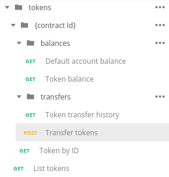

In Body, change the `to` address to match the second account's address you
created in the previous step:

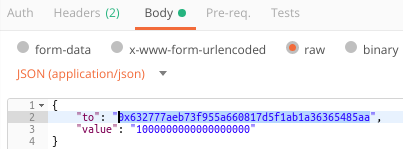

Then change `value` to `2000000000000000000`:

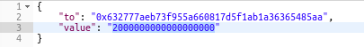

Then hit Send. The response is as follows:

```json
{
  "data": {
    "id": "e052bd11-d899-4444-814b-d179444e6b9d",
    "type": "contract-method",
    "contractId": "54ccdb8a-8177-4bbf-8a3a-1af38be82a33",
    "from": "0xd684ea9d172552e28ca8dfe4d9d39b49180741e7",
    "method": "transfer",
    "parameters": [
      "0x5aabd741e0adc7915aa540d75fd49c7b4f953bfb",
      "2000000000000000000"
    ],
    "status": "new",
    "created": "2020-08-27T23:51:54.964Z",
    "network": "rinkeby"
  }
}
```

As before, the response refers to a transaction, rather than the result of the
transfer. Refer to [Step 3](#_3-getting-the-status-of-a-transaction-2) to check 
on the status of the transaction.

### 7. Get the token balance of another account

In Step 5 we retrieved the balance of your default account, but you can also
query the balance of any other account by their address.

To check the balance of your second account, use the "GET Token balance"
endpoint.

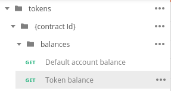

In Params, set the `address` value to match your second account's address.

Hit Send. The response is as follows:

```json
{
    "data": "2000000000000000000"
}
```

### 8. Return half of the tokens

To demonstrate sending tokens from a non-default account, we'll send half of the
tokens back, again using "POST Transfer tokens".


This time, replace the Body with the following:

- `<new-address>` replaced with the address of your second account.

```json
{
    "from": "<new-address>",
    "to": "0xd684ea9d172552e28ca8dfe4d9d39b49180741e7",
    "value": "1000000000000000000"
}
```

Like this:

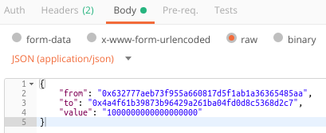

Hit Send. The response is as follows:

```json
{
    "data": {
        "id": "e3981e4b-d31e-47f4-862e-ccdb3b39ccce",
        "status": "new",
        "created": "2018-08-15T19:32:33.153Z"
    }
}
```

As before, refer to [Step 3](#_3-getting-the-status-of-a-transaction-2) 
to get the status of the transaction.
