# Using Automate

You can either view the video guide, or follow the text guide below.

@[youtube](u4_PFA7qX6k)

## 1. Set up accounts

For this guide, you will need:

- A **Stripe** account, which can be either a fully activated production account, or just a test account.
- A **Blockwell** account, which you can create on the Automate page with the *Sign In* button.

-  [Go To Automate](https://app.blockwell.ai/automate)

Once you have **both a Stripe and a Blockwell account set up**, you can proceed.

## 2. Add payment processor 

On the [Automate](https://app.blockwell.ai/automate) page, the second step shown as follows:

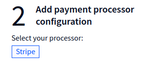

Select _Stripe_ as the processor, which will open up an additional box:

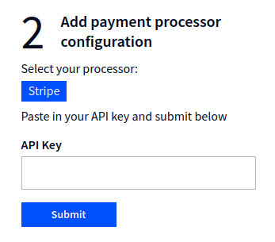

It's asking for a Stripe API key to connect to Stripe. For this purpose, you should create a new **Restricted key**,
only giving it the permissions necessary.

First, find the [test API keys](https://dashboard.stripe.com/test/apikeys) page for your account, or if using live
payments, the [production API keys](https://dashboard.stripe.com/apikeys). The page will look something like this:

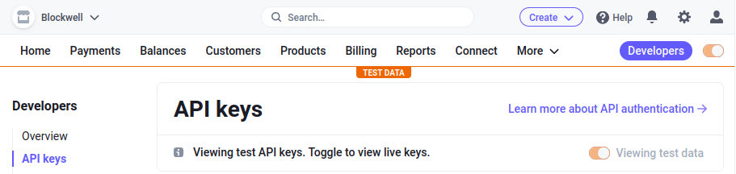

Scroll down to restricted keys, and click "+ Create restricted key":

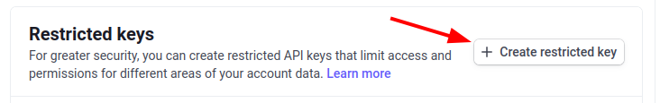

Give the key a name for your own reference, for example "automate". Below that is a long list of permissions - 
Automate requires the following:

- **Prices**: **Write**
- **Webhook Endpoints**: **Write**
- **Payment Links**: **Write**

The _Prices_ and _Payment Links_ permissions are needed to create the link to a payment page, while the _Webhook_
permission is needed to setup the connection from Stripe to the blockchain.

Once you've selected the three permissions, click the **Create key** button at the bottom of the page. After the
key is created, it will be listed in the Restricted keys:

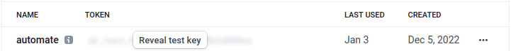

Click the **Reveal test key** button, and then click the key text itself to copy the key to your clipboard.

Go back to the Automate page, and paste the key into the API Key box:

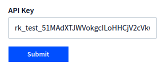

Click **Submit**, and as long as the key is valid you will see a message saying _Stripe Configured_.

## 3. Create payment link

Now that a processor has been configured, you can create a payment link. The **payment link** can then be **turned
into a button you can embed** for accepting payments.

Click the **Create Link** button on the page:

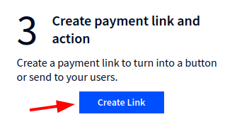

This will open the page for setting up the new payment link. Select Stripe for the Payment Processor:

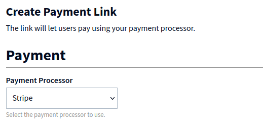

Enter a **Product Name** and its **Price** in the form that appears. This is what your users will see
when they go to pay, and the Price is the total payment amount.

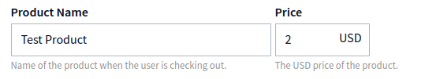

Once the product has been set up, you can configure the Action that will be taken when a payment is made. For this
guide, select _Transfer ERC-20 Tokens_ as the **Type of Action**, after which the form will look like this:

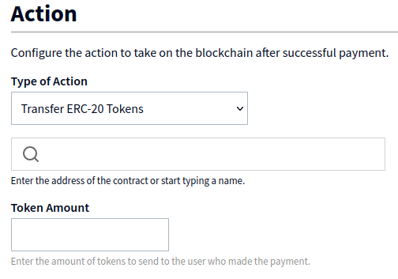

The Action needs to know which token to send, and how many tokens. The first box lets you search for a token,
and then you just need to enter an amount. In this guide, we've selected _Goerli Food Coin_ for the token, and
set it to send 1 token after payment:

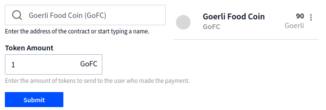

You'll notice that a box appears to the right of the token search to show your balance of that token for reference.

After you've selected the token and set the amount, just click **Submit**.

## 4. Payment link page

After you create your payment link, a page will open showing the link's status, configuration, and embed controls.

When a payment link is first created, you'll notice that the Status says **Out**:

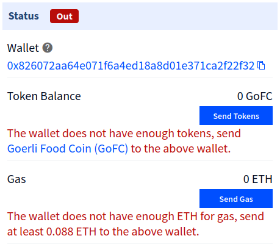

The Automation is **powered** by a **secondary wallet** created under your Blockwell account.

For that secondary wallet to perform the desired action, **it must have the tokens and gas to pay for it**. The status
on this page will let you know if the wallet is low on or out of either of those, and gives you buttons to send it
the resources it needs.

## 5. Payment button

Once the wallet has the resources it needs, the only thing remaining is to use the payment link. For this,
the page includes an Embed section that lets you customize the text and color of the button, and then copy
the code to your own page:

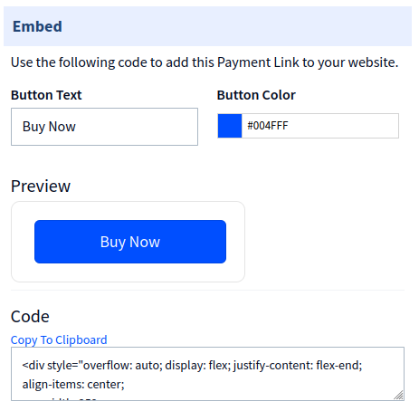

You can also just copy the link from the Preview button and use it elsewhere, as long as that link is used, the
Automate configuration will work from anywhere.
