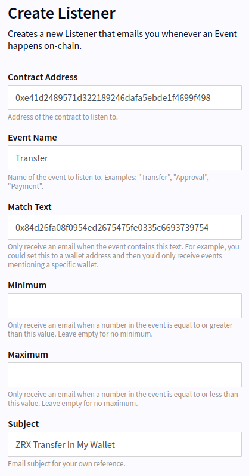
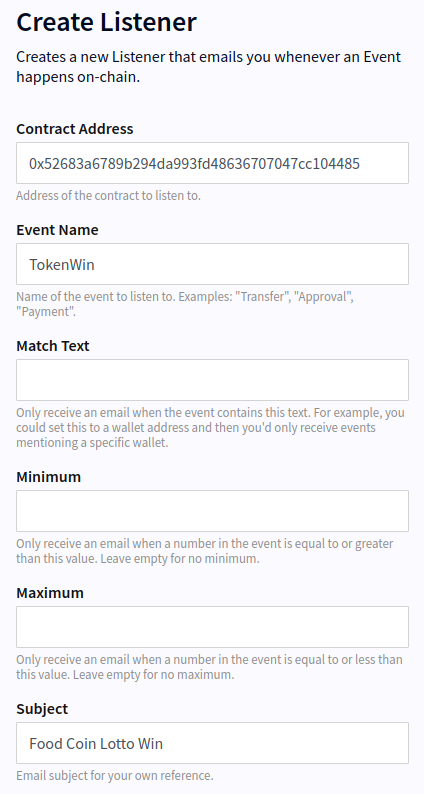

# Listener

## Example Configurations

### Transfer To Wallet

This configuration listens to ZRX transfers to or from a specific wallet
(0x84d...):

### Kyber USDT Trade

Listens to anyone trading USDT on Kyber:

### Food Coin Lotto Winning

Listens to someone winning Food Coin in Lotto 
([https://app.blockwell.ai/lotto/food-coin-lotto](https://app.blockwell.ai/lotto/food-coin-lotto)):

## Create

Create a Listener using the following dumbapp:

<Qr code="jelsl0">Create Listener</Qr>
