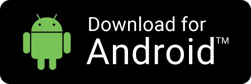

# Blockwell Wallet

[https://app.blockwell.ai](https://app.blockwell.ai)

## Introduction

Blockwell Wallet is a system for making any kind of blockchain interaction very easy.
Anyone can create unique QR Codes that when scanned using a white-labelable Blockwell Wallet Wallet
app allows anyone make transactions with smart contracts in a few seconds.

QR Codes can be made simply for transferring tokens, or they can be complex
multi-step actions that do several transactions in one.

The QR Codes can be used on any system that has a web browser. On mobile devices
you can just scan the QR and it'll load up the right transaction.

## Blockwell Wallet Apps

Blockwell Wallet is currently available as a native app for Android, and as a web app
for other systems.

Or you can [use the Web App here](https://app.blockwell.ai/app).
