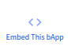

# bApp MetaMask Embed

## Introduction

[bApps](./bapps.md) can be embedded as a simple MetaMask-compatible button on any website. With a **simple copy and
paste**, you can **enable your users to use the blockchain** directly on your website without any significant time
investment.

In addition to bApps, you can also [embed a "connect" button](#connect-button) that just loads the user's MetaMask
wallet, either on page load or when the user clicks a button.

## Usage

At the bottom of any bApp page ([for example](https://app.blockwell.ai/izfd2j))
the following button is shown:



Clicking it opens a dialog that shows you the code you can copy and paste to a page to embed the bApp as a button.

The code will look something like this:

```html
<div class="dumbappembed-container"
     data-label="Sample bApp"
     data-shortcode="izfd2j"
     data-args="value=1"></div>
<script src="https://cdn.blockwell.ai/dumbappembed/bundle.js"/>
<link rel="stylesheet" type="text/css" href="https://cdn.blockwell.ai/dumbappembed/main.css"/>
```

And here is that code on this page, fully working:

<div class="dumbappembed-container"
    data-label="Sample bApp"
    data-shortcode="izfd2j"
    data-args="value=1"></div>
<script src="https://cdn.blockwell.ai/dumbappembed/bundle.js" />
<link rel="stylesheet" type="text/css" href="https://cdn.blockwell.ai/dumbappembed/main.css" />

**Note** that you only need to include the `<script` and `<link` lines once in your application, they will automatically
process all embeds on the page.

## Configuration

The embed is configured using the `data-*` HTML attributes. The options are:

- `data-label` is the label text inside the button. Changing this will change what the button says.
- `data-shortcode` is the shortcode for the specific bApp to load. This is the same as in the link for a bApp on
  Blockwell Wallet. For example, the link
  `https://app.blockwell.ai/izfd2j` has the shortcode `izfd2j`.
- `data-args` specifies the arguments to give to the bApp.
  [Read more about arguments](#arguments).
- `data-type` can have an arbitrary identifier or string. [Read more about `data-type`](#data-type).

Any configuration change will be picked up immediately by the embed, so you can use JavaScript to change the values on
the fly.

## Arguments

The easiest way to specify arguments is to use the Embed This bApp button on the Blockwell Wallet page, but the
arguments can be set or updated directly as well.

Let's take a closer look at the arguments in `data-args`:

```properties
data-args="value=1"
```

It's setting `value` to `1` - in this case that means the token transfer will transfer 1 FC. If you change the `1` to
a `2`, like so:

```properties
data-args="value=2"
```

The app would then transfer 2 FC.

Here's a more complex example:

```properties
data-args="account=0xd684ea9d172552e28ca8dfe4d9d39b49180741e7&value=1"
```

This time it's giving the value for two different arguments, `account`
and `value`. Each argument is separated by an ampersand `&`.

That may look familiar from web links; it's the same format used by what's called
a [query string](https://en.wikipedia.org/wiki/Query_string) at the end of a link.

In technical terms, the arguments need to be encoded as a query string. Changing
`data-args` will update the button immediately as well, so you can control it from your application.

## Argument Examples

Here's a quick example demonstrating how that might be done with plain JavaScript:

```javascript
function updateButton(tokenValue) {
    let element = document.querySelector(".dumbappembed-container");
    let query = new URLSearchParams({value: tokenValue});
    element.setAttribute("data-args", query.toString());
}
```

In Vue.js it might look like this:

```vue
<div class="dumbappembed-container"
     data-label="Sample bApp"
     data-shortcode="izfd2j"
     :data-args="new URLSearchParams({value: tokenValue}).toString()"></div>
```

And in React:

```jsx
render()
{
    const {tokenValue} = this.props;
    let query = new URLSearchParams({value: tokenValue});
    return (
        <div class="dumbappembed-container"
             data-label="Sample bApp"
             data-shortcode="izfd2j"
             data-args={query.toString()}
        ></div>
    )
}
```

## `data-type`

In the `data-type` parameter you can add a type identifier that lets your application distinguish between different
types of buttons.

The value can be any string, and it will be passed as-is into [all embed events](#events) as part of the payload. This
means you can also encode data into it. For example in React:

```jsx
render()
{
    return (
        <div class="dumbappembed-container"
             data-label="Sample bApp"
             data-shortcode="izfd2j"
             data-args="value=1"
             data-type={JSON.stringify({id: "my-id", extra: "data"})}
        ></div>
    )
}
```

The [embed events](#events) will then have a `type` parameter with the encoded JSON, which you can parse to get the
original data.

## Styling

The embed code includes the addition of a base style sheet with a neutral theme:

```html
<link rel="stylesheet" type="text/css" href="https://cdn.blockwell.ai/dumbappembed/main.css"/>
```

There are two options for customizing the styling:

1. The colors all use CSS variables, so you can just override the variables.
2. You can download and modify the linked stylesheet and use that instead.

### Styling with CSS variables

If you set the variables in the inner element, those will be prioritized. For example:

```html
<style>
    .dumbappembed-inner {
        --button-text: #ffffff;
        --button-color: #6d358f;
        --button-border: #6d358f;
        --button-hover: #592e80;
        --button-focus-outline: rgba(0, 0, 0, 0.3);
        --button-disabled: #999;
        --button-disabled-text: #eee;
        --button-disabled-border: #999;
        --button-border-radius: 3px;
        --progress-color: #6d358f;
        --error-text: #650a30;
    }
</style>
```

Here's what that looks like:


<div class="dumbappembed-container dumbappembed-theme1"
    data-label="Sample bApp"
    data-shortcode="izfd2j"
    data-args="value=1"></div>
<script src="https://cdn.blockwell.ai/dumbappembed/bundle.js" />
<link rel="stylesheet" type="text/css" href="https://cdn.blockwell.ai/dumbappembed/main.css" />

<style>
.dumbappembed-theme1 .dumbappembed-inner {
  --button-text: #ffffff;
  --button-color: #6d358f;
  --button-border: #6d358f;
  --button-hover: #592e80;
  --button-focus-outline: rgba(0, 0, 0, 0.3);

  --button-disabled: #999;
  --button-disabled-text: #eee;
  --button-disabled-border: #999;

  --button-border-radius: 3px;

  --progress-color: #6d358f;

  --error-text: #650a30;
}
</style>

And here's another alternative:

```html
<style>
    .dumbappembed-inner {
        --button-text: #02806e;
        --button-color: transparent;
        --button-border: #02806e;
        --button-hover: rgba(1, 119, 92, 0.2);
        --button-border-radius: 20px;
    }
</style>
```

And again here's what that looks like:

<div class="dumbappembed-container dumbappembed-theme2"
    data-label="Sample bApp"
    data-shortcode="izfd2j"
    data-args="value=1"></div>
<script src="https://cdn.blockwell.ai/dumbappembed/bundle.js" />
<link rel="stylesheet" type="text/css" href="https://cdn.blockwell.ai/dumbappembed/main.css" />
<style>
.dumbappembed-theme2 .dumbappembed-inner {
  --button-text: #02806e;
  --button-color: transparent;
  --button-border: #02806e;
  --button-hover: rgba(1, 119, 92, 0.2);
  --button-border-radius: 20px;
}
</style>

## "Connect" button

Sometimes you want your user to just connect to the page with their wallet, and for that purpose there's a special "
connect" embed:

```html
<div class="dumbappembed-container"
     data-label="Connect Wallet"
     data-component="connect"></div>
```

Which looks like this:

<div class="dumbappembed-container"
     data-label="Connect Wallet"
     data-component="connect"></div>

If a wallet is loaded, it will display the wallet address below the button like so:

```html
<div class="dumbappembed-inner dumbappembed-connect dumbappembed-connected">
    <button class="btn btn-primary btn-connect" disabled="disabled">Connect Wallet</button>
    <div class="dumbappembed-account">0x1234567890123456789012345678901234567890</div>
    ...
```

The `dumbappembed-connect` div will have a `dumbappembed-connected` class added to it, so you could hide the button and just
show the wallet address using CSS.

The connect embed has one additional parameter called `data-auto`. If provided non-empty, the embed will ask the user to
connect their wallet as soon as the page finishes loading. For example:

```html
<div class="dumbappembed-container"
     data-component="connect"
     data-auto="yes"></div>
```

## Events

The embed has a number of events dispatched through the browser window object, and you can subscribe to them using the
standard `addEventListener` function. For example:

```javascript
window.addEventListener("dumbapp-complete", (ev) => {
    console.log("Complete!", ev.detail);
});
```

The event object passed is a [CustomEvent](https://developer.mozilla.org/en-US/docs/Web/API/CustomEvent), with the
`ev.detail` property containing the relevant data.

There are 5 different event types, which are defined in more detail below. All of the events have a `state` property,
which is a `string` with the following definition:

```typescript
type MetamaskState =
        | "ready" // MetaMask exists but is not connected to
        | "no-metamask" // No MetaMask in the browser
        | "loading-accounts" // Wallets are being requested
        | "accounts-loaded" // Wallets have been loaded
        | "accounts-rejected" // User rejected connection
        | "no-accounts"; // User has no wallets
```

Events triggered by bApp submissions have a `status` property describing the current status of the transaction,
defined as follows:

```typescript
type SubmissionStepStatus =
    | "new" // New submission not processed yet
    | "confirm" // Waiting for confirmation from the user
    | "network" // MetaMask changed to the wrong network, or dropped connection
    | "nonce" // A nonce has been assigned, but not yet submitted
    | "submitted" // Submitted to the blockchain
    | "completed" // Transaction was sent and included in a block
    | "unknown" // Unknown status, for example if MetaMask extension is uninstalled
    | "error" // Transaction failed in an error
```

### Approval

All events, with the exception of `dumbapp-connection`, may also contain a boolean property named `approval`.

Some transactions require an approval to be submitted for a token before it can be executed. For ERC-20 tokens this
allows the contract being executed to use tokens from the user's account. For ERC-721, it allows the contract to transfer
NFTs from the user, for example to list them on a market.

When approval is needed, a separate transaction will be processed first for the approval. That transaction behaves
exactly the same as the standard bApp transaction, including emitting the same events. The only difference is that
if the transaction is for approval, it has the `approval` boolean set to true.

### `dumbapp-connection`

```javascript
window.addEventListener("dumbapp-connection", (ev) => {
    console.log("Connection event in state:", ev.detail.state);
});
```

- `ev` is `CustomEvent<WalletConnectionEvent>` where WalletConnectionEvent is defined as:

```typescript
interface WalletConnectionEvent {
    state: WalletState;
    account?: string;
    chainId?: number;
}
```

The `dumbapp-connection` event is fired every time the state of the MetaMask connection to the application changes. This
typically happens when the user is connecting MetaMask to the app, when they change their wallet, or their selected
network.

The latest known account address and the current chain ID is always included, and they're only missing if the user
has not connected.

### `dumbapp-submit`

```javascript
window.addEventListener("dumbapp-submit", (ev) => {
    console.log("User submitted shortcode:", ev.detail.shortcode);
});
```

- `ev` is `CustomEvent<DumbappSubmitEvent>` where DumbappSubmitEvent is defined as:

```typescript
interface DumbappSubmitEvent {
    id: string;
    shortcode: string;
    status: SubmissionStepStatus;
    type?: string;
    approval?: boolean;
}
```

The `dumbapp-submit` event happens when a user presses the submit button, after a connection to MetaMask has been
established. In practical terms, this event fires right before MetaMask asks the user to confirm the transaction.

#### Event `id`

bApp events also include an `id` property. This is a unique identifier assigned to the submission, and can be used
to make sure a single user press is only ever processed once. The generated ID is a UUID v5 constructed from the
shortcode, wallet address, submission timestamp and arguments.

### `dumbapp-update`

```javascript
window.addEventListener("dumbapp-update", (ev) => {
    console.log("Submission update:", ev.detail.transactionHash);
});
```

- `ev` is `CustomEvent<DumbappUpdateEvent>` where DumbappUpdateEvent is defined as:

```typescript
interface DumbappUpdateEvent {
    id: string;
    shortcode: string;
    status: SubmissionStepStatus;
    type?: string;
    approval?: boolean;
    stepNumber: number;
    stepId: string;
    previousStatus: SubmissionStepStatus;
    transactionHash?: string;
}
```

The `dumbapp-update` event is fired every time, after the initial `dumbapp-submit` event, a change happens in any of 
submission process. This is typically an update to the status of the transaction.

Because bApps can have multiple steps (for example approving before making a trade), the update also has the
properties for which step is being updated, `stepNumber` and `stepId`.

### `dumbapp-complete`

```javascript
window.addEventListener("dumbapp-complete", (ev) => {
    console.log("Completed!", ev.detail.transactionHash);
});
```

- `ev` is `CustomEvent<DumbappCompleteEvent>` where DumbappCompleteEvent is defined as:

```typescript
interface DumbappCompleteEvent {
    id: string;
    shortcode: string;
    status: SubmissionStepStatus;
    type?: string;
    approval?: boolean;
    transactionHash: string;
}
```

The `dumbapp-complete` event is fired when the entire bApp process is finished, which means all steps have been
included in a block on the blockchain. The included `transactionHash` is for the last step in the bApp.

### `dumbapp-error`

```javascript
window.addEventListener("dumbapp-error", (ev) => {
    console.log("Error!", ev.detail);
});
```

- `ev` is `CustomEvent<DumbappErrorEvent>` where DumbappErrorEvent is defined as:

```typescript
interface DumbappErrorEvent {
    id: string;
    shortcode: string;
    status: SubmissionStepStatus;
    type?: string;
    approval?: boolean;
    code?: string;
    message?: string;
}
```

The `dumbapp-error` event is fired when a bApp submission fails and cannot be continued, and the `code` property
will contain the reason if available. The `message` property has a human-friendly error message.

There are a variety of codes from different sources, but some of the more common ones are:

- `rejected` - the user rejected the transaction
- `result_error` - the transaction reverted on the blockchain
- `insufficient_funds` - the wallet didn't have enough ETH to pay for the transaction

## TypeScript

Finally, here are the complete TypeScript definitions for the events.

```typescript
declare global {
    interface WindowEventMap {
        "dumbapp-submit": CustomEvent<DumbappSubmitEvent>;
        "dumbapp-update": CustomEvent<DumbappUpdateEvent>;
        "dumbapp-complete": CustomEvent<DumbappCompleteEvent>;
        "dumbapp-error": CustomEvent<DumbappErrorEvent>;
        "dumbapp-connection": CustomEvent<WalletConnectionEvent>;
    }
}

export type WalletState =
    | "ready"
    | "not-installed"
    | "loading-accounts"
    | "accounts-loaded"
    | "accounts-rejected"
    | "no-accounts";

export type SubmissionStepStatus =
        | "new"
        | "confirm"
        | "network"
        | "nonce"
        | "submitted"
        | "completed"
        | "unknown"
        | "error";

export interface WalletConnectionEvent {
    type: string;
    state: WalletState;
    account?: string;
    chainId?: number;
}

export interface DumbappEventBase {
    id: string;
    shortcode: string;
    status: SubmissionStepStatus;
    type?: string;
    approval?: boolean;
}

export interface DumbappSubmitEvent extends DumbappEventBase {}

export interface DumbappUpdateEvent extends DumbappEventBase {
    stepNumber: number;
    stepId: string;
    previousStatus: SubmissionStepStatus;
    transactionHash?: string;
}

export interface DumbappCompleteEvent extends DumbappEventBase {
    transactionHash: string;
}

export interface DumbappErrorEvent extends DumbappEventBase {
    code?: string;
    message?: string;
}
```
