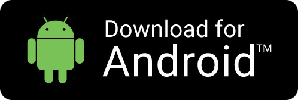
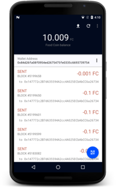
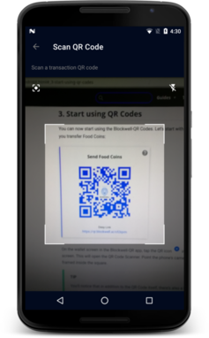
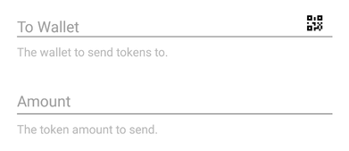
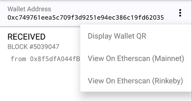
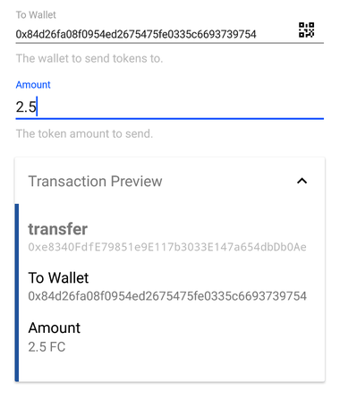
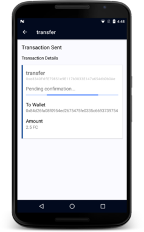

# Getting Started with Blockwell Wallet Android

This guide will get you started using the Blockwell Wallet Android app.

## 1. Install Android App

First, you'll need to install the Blockwell Wallet Android app.

At this time the Blockwell Wallet app is not yet on the Google Play Store, so
you will need to install it manually.

### Enable external apps

Before you can install the app, you will need to allow installing external
or unknown apps on your phone.

**If you have a Samsung phone with Android 8 or newer**

1. Go to **Settings**.
2. Go to **Biometrics and Security**.
3. Go to **Install unknown apps**.
4. Find and select the browser you normally use.
5. Enable **Allow app installs**.

**Other phones with Android 8 or newer**

1. Go to **Settings**.
2. Go to **Security & Privacy**.
3. Go to **More Settings**.
4. Press **Install apps from external sources**.
5. Find and select the browser you normally use.
6. Enable **Allow app installs**.

**Other phones with Android 7 or earlier**

1. Go to **Settings**.
2. Go to **Security**.
3. Under **Device administration** find and enable **Unknown Sources**.

### Download the Blockwell Wallet app

You can download the app by clicking the following on your phone:

Or by visiting [app.blockwell.ai](https://app.blockwell.ai) on your
phone and scrolling down to the "Download for Android" button.

After the download finishes, click to Open the file, and tap "Install".

## 2. Register for an account

Open the installed Blockwell Wallet app, and you'll first see the login screen.
Tap the text **No Account? Register here**.

Fill in your email address and a password and tap **REGISTER**.

After you register, you will be taken to the main wallet screen of the app:

At this point a couple of things will happen in the background:

- You will receive an email with your new Blockwell Wallet address and
  some additional information.
- Your Blockwell Wallet will be sent 0.1 ETH on Rinkeby, and 100 Food Coins
  so you can start playing around with the app and QR Codes.

You will see the Food Coin balance on the wallet screen change to 100 within
a minute of signing up.

::: tip
Your account is the same for all Blockwell Wallet apps, so you can also log in
to the [Web App](https://app.blockwell.ai/app) with the same email and password.
:::

## 3. Scan a QR Code

You can now start using the Blockwell Wallet Codes. Let's start with a simple one,
here's a QR Code that lets you transfer Food Coins:

<Qr code="o53qvm">Send Food Coins</Qr>

On the wallet screen in the Blockwell Wallet app, tap the QR icon 
 in the bottom-right corner of the
screen. This will open the QR Code Scanner. Point the phone's camera towards
the QR Code so that it's framed inside the square:

::: tip
You'll notice that in addition to the QR Code itself, there's also a **Deep
Link** below it. With a Deep Link you can still use the QR Code by simply
clicking the link, even if you're unable to scan the QR Code itself.

For example if you're viewing this page on your phone, you obviously can't
scan the QR Code on the phone's screen with the same phone (except maybe
with a couple of mirrors). 

If you click the link on your Android phone that has the app, it will take
you into the app. If you click the link on a different device, you will
be taken to the Web App version.
:::

## 4. Fill in the form

After scanning the QR Code, the app will present you with a screen that
lets you fill in any details the transaction might need. If you scanned
the QR Code on this page, you'll see the following form:

In the form you can fill in the wallet address you want to send Food Coins
to, and the amount you want to send.

You'll notice that the To Wallet field has a small QR icon on the right.
You can tap that icon to scan a wallet address from someone else's phone,
as well as other wallet software like Ledger, Trezor, MetaMask and so on.

The Blockwell Wallet app can display a QR of your Blockwell Wallet as well.
Tap the three dots to the right of your wallet address on the main screen
and select *Display Wallet QR*.

::: tip
You can always copy your own Blockwell Wallet address to clipboard by
tapping the address on your wallet screen.
:::

## 5. Preview the transaction

Once you've filled in the form, you can preview what the transaction
on the blockchain will be by tapping *Transaction Preview*:

The preview is showing that it'll perform the `transfer` function on
the contract at address `0xe8340FdfE79851e9E117b3033E147a654dbDb0Ae`,
which is the address of Food Coin.

Below that it's showing all arguments of the contract function. In
this case the arguments are the same as what you typed into the form.

## 5. Accept

Finally, you only need to tap **ACCEPT** and the transaction will be
sent and you'll be presented with the confirmation screen:

This screen will update as the status of the transaction changes.

## 6. What's next

Now you can use Blockwell Wallet with other QR Codes. For example, you
can [deploy your own ERC20 token](../contracts/prime.md), or you can
read about [creating QR Codes](./creating-qr.md).
