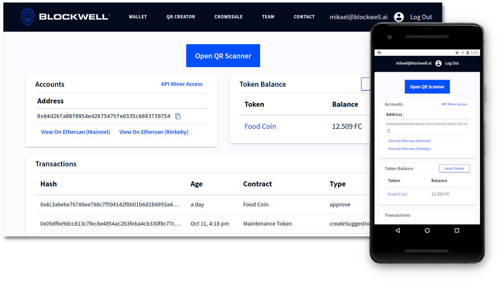
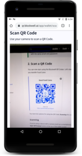
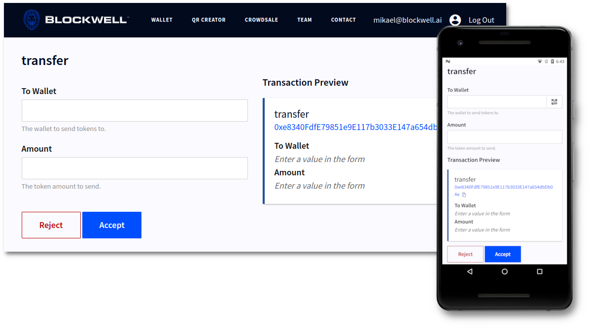
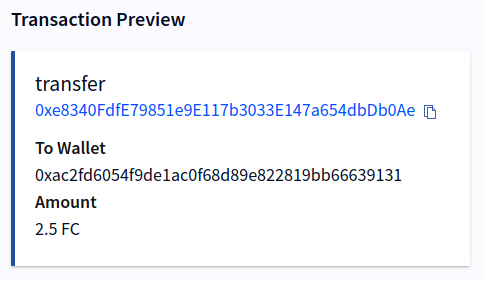
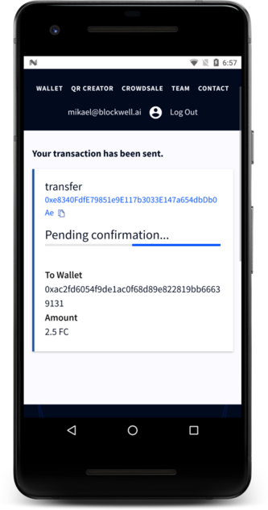

# Getting Started with Blockwell Wallet Web

This guide will get you started using the Blockwell Wallet Web App.

## 1. Register for an account

Go to [app.blockwell.ai](https://app.blockwell.ai) using your
browser. You can use a desktop computer, or a mobile device such as an
iPhone.

Fill in your email address and a password and click **Sign In**.

After you register, you will be taken to the main wallet screen of the app:

At this point a couple of things will happen in the background:

- You will receive an email with your new Blockwell Wallet address and
  some additional information.
- Your Blockwell Wallet will be sent 0.1 ETH on Rinkeby, and 100 Food Coins
  so you can start playing around with the app and QR Codes.

Note that the Food Coin balance in the Web App does not update automatically
currently, you'll need to refresh the page to see the balance updated.

::: tip
Your account is the same for all Blockwell Wallet apps, so you can also log in
to the [Android App](./getting-started-android.md) with the same email and 
password.
:::

## 2. Scan a QR Code

You can now start using the Blockwell Wallet Codes. Let's start with a simple one,
here's a QR Code that lets you transfer Food Coins:

<Qr code="o53qvm">Send Food Coins</Qr>

You have two options for using the QR Code, **Scanning** the code or 
using the **Deep Link**.

### Scanning

If you're using a device with a camera (such as a smartphone), you can use
the scanner by clicking the **Open QR Scanner** button at the top of the
wallet screen.

This will open a page that asks to use your camera. The camera feed is never
sent anywhere, it's only used on your device to scan for the QR Code. 

Point the scanner towards the QR Code so that it's in the middle of the
view:

### Deep Link

If you're on a device without a camera, or you're unable to scan the QR
Code for other reasons, you can also simply click the Deep Link right
below the QR Code.

Using the Deep Link has the same effect as scanning the QR Code, so you
can use whichever is more convenient.

## 4. Fill in the form

After scanning the QR Code, the app will present you with a screen that
lets you fill in any details the transaction might need. If you scanned
the QR Code on this page, you'll see the following form:

In the form you can fill in the wallet address you want to send Food Coins
to, and the amount you want to send.

If your device has a camera for scanning QR Codes with, you'll notice that 
the To Wallet field has a small QR icon on the right. You can tap that 
icon to scan a wallet address from other  wallet software like Ledger, 
Trezor, MetaMask and so on.

## 5. Preview the transaction

Next to the form is the Transaction Preview:

The preview is showing that it'll perform the `transfer` function on
the contract at address `0xe8340FdfE79851e9E117b3033E147a654dbDb0Ae`,
which is the address of Food Coin.

Below that it's showing all arguments of the contract function. In
this case the arguments are the same as what you typed into the form.

## 5. Accept

Finally, you only need to click **Accept** and the transaction will be
sent and you'll be presented with the confirmation screen:

This screen will update as the status of the transaction changes.

## 6. What's next

Now you can use Blockwell Wallet with other QR Codes. For example, you
can [deploy your own ERC20 token](../contracts/prime.md), or you can
read about [creating QR Codes](./creating-qr.md).
